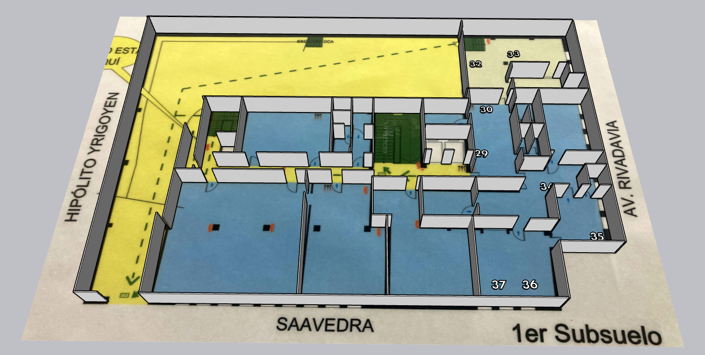

  

---

# JUSTIFICACIÓN #

* Se trata de un repositorio interno que satisface nuestras necesidades.
* Es una representación en 3D de nuestro hardware, dividida en tres niveles.
* Forma parte de un conjunto de [formularios de Google](Google_forms.md) creados para la ocasión: recopilar la ubicación espacial de cada dispositivo (monitores, CPU, discos duros portátiles, impresoras, etc.).
  

### ¿Para qué sirve este repositorio? ###

### Resumen rápido
* Representación en 3D de todos los dispositivos y hardware que pertenecen a la institución.

### Código de conducta

* Consulte nuestro [Código de conducta](Code_of_conduct.md)

### Aspectos legales

* Todas las marcas comerciales son propiedad de sus respectivos propietarios.

### Licencia

* El contenido de este proyecto está sujeto a la licencia 
